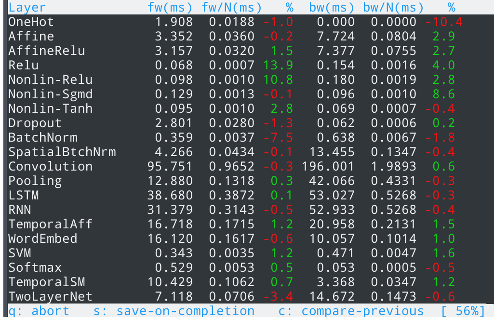

# Benchmarks for all network layers

This benchmarks all currently implemented neural network layers.

Affine, Relu, Nonlinearity, AffineRelu, BatchNorm, Dropout, Convolution, Pooling,
SpatialBatchNorm, RNN, LSTM, WordEmbedding, TemporalAffine, TemporalSoftmax, Softmax, Svm, TwoLayerNet.

## Requirements

Check the [main page](../../..) for build requirements. Additionally, `curses` is needed.

## Build

After configuration of CMake, `bench` can be built directly by:

```bash
make bench
```

The code in [`cp-bench.cpp`](cp-bench.cpp) shows one-liner layer definitions for all network layers within `benchRecipes`, which can be used as examples of layer definitions.

## Note on performance

Syncognite in its current stage has not been optimized. Several parts of the code contain self-checks that significantly impact performance. This will be addressed once the first level of functionality is complete, and beta stage is entered.

Currently, best peformance seems to be achieved with Clang 4.0. Using Clang 4 however requires the dev-branch of Eigen 3 [3.3.90] in order to compile.

## Extending the benchmarks

New benchmarks can be added by extending `benchRecipes`:

```cpp
map<string, string> benchRecipes = {
    {"Affine", R"({"benchIdx":1,"benchName":"Affine","benchN":100,"inputShape":[1024],"hidden":1024})"},
    {"Convolution", R"({"benchIdx":10,"benchName":"Convolution","benchN":100,"inputShape":[3,32,32],"kernel":[64,5,5],"stride":1,"pad":2})"},
    {"LSTM", R"({"benchIdx":12,"benchName":"LSTM","benchN":100,"inputShape":[100,80],"N":100,"H":256})"},
// ...
};
```

## Usage

```bash
bench/bench
```

Press `q` to stop the Benchmarks, `s` to save results to `bench.txt` on completion, `c` to
compare relative improvements to previously saved results.

## Output


