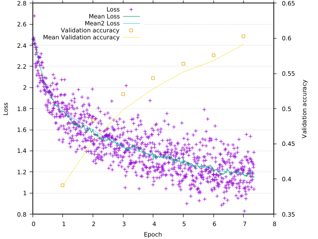

# Training with CIFAR10 images

## Requirements

Check the [main page](../../..) for build requirements.

## Build

After configuration of CMake, the cifar10 part can be built directly by:

```bash
# use Ninja or Xcode, if the main project had been configured correspondingly
make cifar10test
```

## Dataset

Use the [script download_cifar10.py](../datasets/) to download the CIFAR10 training data in HDF5 format.

## Training

From build directory:

```bash
cpcifar10/cifar10test ../datasets/cifar10.h5 [mode]
```

`mode`: `0`: train with RELU nonlinearities, `1`: use SELU ("scaled exponential linear units" (SELUs), https://arxiv.org/abs/1706.02515), `2` train with [resilu](https://github.com/domschl/syncognite/tree/resilu-tests#resilu-non--linearity)

## Logging

For live logging of the training progress, use gnuplot:

```bash
gnuplot ../plot/liveplot.gnu
```



Note: Currently, this works only after 1. episode is complete.

## Output

```bash
$ cpcifar10/cifar10test ../datasets/cifar10.h5
Reading: test-data dataset rank = 4, dimensions; 10000 x 3 x 32 x 32 int
test-labels dataset rank = 1, dimensions; 10000 int
train-data dataset rank = 4, dimensions; 50000 x 3 x 32 x 32 int
train-labels dataset rank = 1, dimensions; 50000 int

test-data (10000, 3072)
test-labels (10000, 1)
train-data (50000, 3072)
train-labels (50000, 1)
test-data tensor-4
train-data tensor-4
Compile-time options: FLOAT AVX FMA OPENMP
Eigen is using:      1 threads.
CpuPool is using:    8 threads.
Cpu+GpuPool is using:    0 threads.
Checking LayerBlock topology...
cv1: (3, 32, 32)[3072] -> (64, 32, 32)[65536]
sb1: (64, 32, 32)[65536] -> (64, 32, 32)[65536]
rl1: (64, 32, 32)[65536] -> (64, 32, 32)[65536]
doc1: (64, 32, 32)[65536] -> (64, 32, 32)[65536]
cv2: (64, 32, 32)[65536] -> (64, 32, 32)[65536]
rl2: (64, 32, 32)[65536] -> (64, 32, 32)[65536]
cv3: (64, 32, 32)[65536] -> (128, 16, 16)[32768]
sb2: (128, 16, 16)[32768] -> (128, 16, 16)[32768]
rl3: (128, 16, 16)[32768] -> (128, 16, 16)[32768]
doc2: (128, 16, 16)[32768] -> (128, 16, 16)[32768]
cv4: (128, 16, 16)[32768] -> (128, 16, 16)[32768]
rl4: (128, 16, 16)[32768] -> (128, 16, 16)[32768]
cv5: (128, 16, 16)[32768] -> (256, 8, 8)[16384]
sb3: (256, 8, 8)[16384] -> (256, 8, 8)[16384]
rl5: (256, 8, 8)[16384] -> (256, 8, 8)[16384]
doc3: (256, 8, 8)[16384] -> (256, 8, 8)[16384]
cv6: (256, 8, 8)[16384] -> (256, 8, 8)[16384]
rl6: (256, 8, 8)[16384] -> (256, 8, 8)[16384]
doc4: (256, 8, 8)[16384] -> (256, 8, 8)[16384]
cv7: (256, 8, 8)[16384] -> (512, 4, 4)[8192]
rl7: (512, 4, 4)[8192] -> (512, 4, 4)[8192]
doc5: (512, 4, 4)[8192] -> (512, 4, 4)[8192]
cv8: (512, 4, 4)[8192] -> (512, 4, 4)[8192]
rl8: (512, 4, 4)[8192] -> (512, 4, 4)[8192]
af1: (512, 4, 4)[8192] -> (1024)[1024]
bn1: (1024)[1024] -> (1024)[1024]
rla1: (1024)[1024] -> (1024)[1024]
do1: (1024)[1024] -> (1024)[1024]
af2: (1024)[1024] -> (512)[512]
bn2: (512)[512] -> (512)[512]
rla2: (512)[512] -> (512)[512]
do2: (512)[512] -> (512)[512]
af3: (512)[512] -> (10)[10]
sm1: (10)[10] -> (1)[1]
Topology-check for LayerBLock: ok.
Training net: data-size: 49000, chunks: 980, batch_size: 50, threads: 8 (bz*ch): 49000
Ep: 1, Time: 1369s, (13s test) loss:1.773042 err(val):0.609000 acc(val):0.391000.773101453
Ep: 2, Time: 1361s, (14s test) loss:1.597675 err(val):0.516000 acc(val):0.484000.603656972
Ep: 3, Time: 1362s, (12s test) loss:1.433608 err(val):0.479000 acc(val):0.521000.436751770
Ep: 4, Time: 1359s, (12s test) loss:1.359592 err(val):0.457000 acc(val):0.543000.369401933
Ep: 5, Time: 1343s, (12s test) loss:1.286471 err(val):0.436000 acc(val):0.564000.273972529
Ep: 6, Time: 1346s, (13s test) loss:1.223408 err(val):0.424000 acc(val):0.576000.225793357
Ep: 7, Time: 1356s, (12s test) loss:1.178642 err(val):0.397000 acc(val):0.603000.177728710
Ep: 8, Time: 1361s, (13s test) loss:1.137488 err(val):0.374000 acc(val):0.626000.141184944
Ep: 9, Time: 1364s, (13s test) loss:1.116926 err(val):0.362000 acc(val):0.638000.119372196
Ep: 10, Time: 1354s, (13s test) loss:1.059759 err(val):0.336000 acc(val):0.664000.054725048
Ep: 11, Time: 1368s, (12s test) loss:0.997422 err(val):0.325000 acc(val):0.675000.003670459
Ep: 12, Time: 1356s, (12s test) loss:0.969635 err(val):0.296000 acc(val):0.704000.964603988
Ep: 13, Time: 1356s, (12s test) loss:0.944014 err(val):0.293000 acc(val):0.707000.956385960
Ep: 14, Time: 1363s, (14s test) loss:0.904938 err(val):0.296000 acc(val):0.704000.907651125
Ep: 15, Time: 1359s, (12s test) loss:0.852439 err(val):0.267000 acc(val):0.733000.850288041
Ep: 16, Time: 1359s, (12s test) loss:0.857193 err(val):0.266000 acc(val):0.734000.850574656
Ep: 17, Time: 1361s, (13s test) loss:0.815470 err(val):0.255000 acc(val):0.745000.820043432
Ep: 18, Time: 1338s, (12s test) loss:0.782973 err(val):0.256000 acc(val):0.744000.783037590
Ep: 19, Time: 1326s, (12s test) loss:0.743810 err(val):0.247000 acc(val):0.753000.731883702
Ep: 20, Time: 1332s, (12s test) loss:0.734768 err(val):0.239000 acc(val):0.761000.727214807
Ep: 21, Time: 1326s, (12s test) loss:0.689683 err(val):0.240000 acc(val):0.760000.694405632
Ep: 22, Time: 1323s, (12s test) loss:0.679138 err(val):0.227000 acc(val):0.773000.677342569
Ep: 23, Time: 1325s, (12s test) loss:0.658063 err(val):0.234000 acc(val):0.766000.664037277
Ep: 24, Time: 1310s, (12s test) loss:0.612781 err(val):0.225000 acc(val):0.775000.603546196
Ep: 25, Time: 1321s, (12s test) loss:0.632008 err(val):0.208000 acc(val):0.792000.625720851
Ep: 26, Time: 1330s, (12s test) loss:0.559627 err(val):0.212000 acc(val):0.788000.564914247
Ep: 27, Time: 1324s, (12s test) loss:0.570422 err(val):0.213000 acc(val):0.787000.564646240
Ep: 28, Time: 1323s, (12s test) loss:0.534862 err(val):0.213000 acc(val):0.787000.535824721
Ep: 29, Time: 1319s, (12s test) loss:0.506240 err(val):0.209000 acc(val):0.791000.506116784
Ep: 30, Time: 1324s, (12s test) loss:0.507575 err(val):0.200000 acc(val):0.800000.504689279
Ep: 31, Time: 1326s, (12s test) loss:0.486595 err(val):0.194000 acc(val):0.806000.488777527
Ep: 32, Time: 1325s, (12s test) loss:0.496329 err(val):0.196000 acc(val):0.804000.484871926
Ep: 33, Time: 1324s, (13s test) loss:0.466785 err(val):0.199000 acc(val):0.801000.467273205
Ep: 34, Time: 1318s, (12s test) loss:0.451971 err(val):0.195000 acc(val):0.805000.443404932
Ep: 35, Time: 1326s, (12s test) loss:0.423440 err(val):0.196000 acc(val):0.804000.427621099
Ep: 36, Time: 1326s, (12s test) loss:0.381521 err(val):0.200000 acc(val):0.800000.386783803
Ep: 37, Time: 1323s, (12s test) loss:0.385132 err(val):0.197000 acc(val):0.803000.384276088
Ep: 38, Time: 1328s, (12s test) loss:0.375425 err(val):0.205000 acc(val):0.795000.374075503
Ep: 39, Time: 1320s, (12s test) loss:0.356085 err(val):0.192000 acc(val):0.808000.362570721
Ep: 40, Time: 1327s, (12s test) loss:0.347994 err(val):0.186000 acc(val):0.814000.350700600
Final results on CIFAR10 after 40.000000 epochs:
      Train-error: 0.036735 train-acc: 0.963265
 Validation-error: 0.186000   val-acc: 0.814000
       Test-error: 0.212600  test-acc: 0.787400

```
