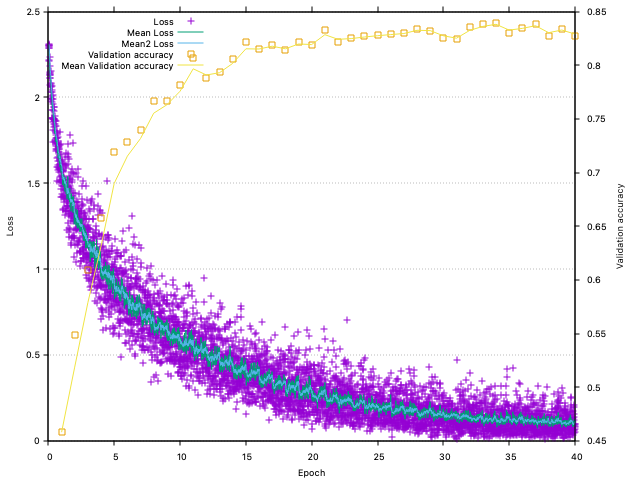

# Training with CIFAR10 images

## Requirements

Check the [main page](../../..) for build requirements.

## Build

After configuration of CMake, the cifar10 part can be built directly by:

```bash
# use Ninja or Xcode, if the main project had been configured correspondingly
make cifar10test
```

## Dataset

Use the [script download_cifar10.py](../datasets/) to download the CIFAR10 training data in HDF5 format.

## Training

From build directory:

```bash
cpcifar10/cifar10test ../datasets/cifar10.h5 [mode]
```

`mode`: 
- `0`: train with RELU nonlinearities,
- `1`: use SELU ("scaled exponential linear units" (SELUs), https://arxiv.org/abs/1706.02515), 
- `2` train with [resilu](https://github.com/domschl/syncognite/tree/master#resilu-non--linearity) linearity and non-linearity.

## Logging

For live logging of the training progress, use gnuplot:

```bash
gnuplot ../plot/liveplot.gnu
```



Note: Currently, this works only after 1. episode is complete.

## Output

```bash
$ cpcifar10/cifar10test ../datasets/cifar10.h5
Reading: test-data dataset rank = 4, dimensions; 10000 x 3 x 32 x 32 int
test-labels dataset rank = 1, dimensions; 10000 int
train-data dataset rank = 4, dimensions; 50000 x 3 x 32 x 32 int
train-labels dataset rank = 1, dimensions; 50000 int

test-data (10000, 3072)
test-labels (10000, 1)
train-data (50000, 3072)
train-labels (50000, 1)
test-data tensor-4
train-data tensor-4
Compile-time options: FLOAT
Eigen is using:      1 threads.
CpuPool is using:    8 threads.
Checking LayerBlock topology...
cv1: (3, 32, 32)[3072] -> (64, 32, 32)[65536]
sb1: (64, 32, 32)[65536] -> (64, 32, 32)[65536]
rl1: (64, 32, 32)[65536] -> (64, 32, 32)[65536]
doc1: (64, 32, 32)[65536] -> (64, 32, 32)[65536]
cv2: (64, 32, 32)[65536] -> (64, 32, 32)[65536]
rl2: (64, 32, 32)[65536] -> (64, 32, 32)[65536]
cv3: (64, 32, 32)[65536] -> (128, 16, 16)[32768]
sb2: (128, 16, 16)[32768] -> (128, 16, 16)[32768]
rl3: (128, 16, 16)[32768] -> (128, 16, 16)[32768]
doc2: (128, 16, 16)[32768] -> (128, 16, 16)[32768]
cv4: (128, 16, 16)[32768] -> (128, 16, 16)[32768]
rl4: (128, 16, 16)[32768] -> (128, 16, 16)[32768]
cv5: (128, 16, 16)[32768] -> (256, 8, 8)[16384]
sb3: (256, 8, 8)[16384] -> (256, 8, 8)[16384]
rl5: (256, 8, 8)[16384] -> (256, 8, 8)[16384]
doc3: (256, 8, 8)[16384] -> (256, 8, 8)[16384]
cv6: (256, 8, 8)[16384] -> (256, 8, 8)[16384]
rl6: (256, 8, 8)[16384] -> (256, 8, 8)[16384]
doc4: (256, 8, 8)[16384] -> (256, 8, 8)[16384]
cv7: (256, 8, 8)[16384] -> (512, 4, 4)[8192]
rl7: (512, 4, 4)[8192] -> (512, 4, 4)[8192]
doc5: (512, 4, 4)[8192] -> (512, 4, 4)[8192]
cv8: (512, 4, 4)[8192] -> (512, 4, 4)[8192]
rl8: (512, 4, 4)[8192] -> (512, 4, 4)[8192]
af1: (512, 4, 4)[8192] -> (1024)[1024]
bn1: (1024)[1024] -> (1024)[1024]
rla1: (1024)[1024] -> (1024)[1024]
do1: (1024)[1024] -> (1024)[1024]
af2: (1024)[1024] -> (512)[512]
bn2: (512)[512] -> (512)[512]
rla2: (512)[512] -> (512)[512]
do2: (512)[512] -> (512)[512]
af3: (512)[512] -> (10)[10]
sm1: (10)[10] -> (1)[1]
Topology-check for LayerBLock: ok.

Training net: data-size: 49000, chunks: 980, batch_size: 50, threads: 8 (bz*ch): 49000
Ep: 1, Time: 370s, (4s test) loss:1.6063 err(val):0.5420 acc(val):0.4580
Ep: 2, Time: 355s, (4s test) loss:1.3319 err(val):0.4510 acc(val):0.5490
Ep: 3, Time: 360s, (4s test) loss:1.1549 err(val):0.3910 acc(val):0.6090
Ep: 4, Time: 364s, (4s test) loss:1.0088 err(val):0.3420 acc(val):0.6580
Ep: 5, Time: 362s, (4s test) loss:0.9439 err(val):0.2810 acc(val):0.7190
Ep: 6, Time: 362s, (3s test) loss:0.8407 err(val):0.2720 acc(val):0.7280
Ep: 7, Time: 357s, (4s test) loss:0.7668 err(val):0.2600 acc(val):0.7400
Ep: 8, Time: 1357s, (3s test) loss:0.6940 err(val):0.2330 acc(val):0.76703
Ep: 9, Time: 571s, (6s test) loss:0.6705 err(val):0.2330 acc(val):0.7670
Ep: 10, Time: 706s, (6s test) loss:0.5921 err(val):0.2180 acc(val):0.7820
Ep: 11, Time: 913s, (7s test) loss:0.5813 err(val):0.1930 acc(val):0.8070
Ep: 12, Time: 1075s, (7s test) loss:0.5183 err(val):0.2120 acc(val):0.78801
Ep: 13, Time: 1446s, (3s test) loss:0.4818 err(val):0.2060 acc(val):0.7940
Ep: 14, Time: 474s, (15s test) loss:0.4520 err(val):0.1940 acc(val):0.8060
Ep: 15, Time: 863s, (5s test) loss:0.4411 err(val):0.1780 acc(val):0.822030
Ep: 16, Time: 572s, (3s test) loss:0.4173 err(val):0.1850 acc(val):0.8150
Ep: 17, Time: 361s, (4s test) loss:0.3772 err(val):0.1810 acc(val):0.8190
Ep: 18, Time: 366s, (4s test) loss:0.3464 err(val):0.1860 acc(val):0.8140
Ep: 19, Time: 1023s, (3s test) loss:0.3346 err(val):0.1780 acc(val):0.8220
Ep: 20, Time: 651s, (15s test) loss:0.2954 err(val):0.1810 acc(val):0.81908
Ep: 21, Time: 711s, (4s test) loss:0.2995 err(val):0.1670 acc(val):0.833006
Ep: 22, Time: 364s, (3s test) loss:0.2469 err(val):0.1780 acc(val):0.8220
Ep: 23, Time: 359s, (3s test) loss:0.2423 err(val):0.1750 acc(val):0.8250
Ep: 24, Time: 361s, (4s test) loss:0.2331 err(val):0.1730 acc(val):0.8270
Ep: 25, Time: 427s, (4s test) loss:0.2023 err(val):0.1720 acc(val):0.8280
Ep: 26, Time: 1049s, (4s test) loss:0.2258 err(val):0.1710 acc(val):0.8290
Ep: 27, Time: 353s, (3s test) loss:0.2006 err(val):0.1700 acc(val):0.8300
Ep: 28, Time: 357s, (4s test) loss:0.1868 err(val):0.1660 acc(val):0.8340
Ep: 29, Time: 439s, (3s test) loss:0.1908 err(val):0.1680 acc(val):0.8320
Ep: 30, Time: 371s, (4s test) loss:0.1653 err(val):0.1750 acc(val):0.8250
Ep: 31, Time: 378s, (4s test) loss:0.1546 err(val):0.1760 acc(val):0.8240
Ep: 32, Time: 405s, (4s test) loss:0.1355 err(val):0.1640 acc(val):0.8360
Ep: 33, Time: 350s, (4s test) loss:0.1340 err(val):0.1620 acc(val):0.8380
Ep: 34, Time: 347s, (4s test) loss:0.1279 err(val):0.1610 acc(val):0.8390
Ep: 35, Time: 347s, (3s test) loss:0.1361 err(val):0.1700 acc(val):0.8300
Ep: 36, Time: 553s, (4s test) loss:0.1333 err(val):0.1650 acc(val):0.8350
Ep: 37, Time: 353s, (4s test) loss:0.1200 err(val):0.1620 acc(val):0.8380
Ep: 38, Time: 346s, (4s test) loss:0.1197 err(val):0.1730 acc(val):0.8270
Ep: 39, Time: 351s, (4s test) loss:0.0957 err(val):0.1660 acc(val):0.8340
Ep: 40, Time: 370s, (4s test) loss:0.1108 err(val):0.1730 acc(val):0.8270
Final results on CIFAR10 after 40.0000 epochs:
      Train-error: 0.0047 train-acc: 0.9953
 Validation-error: 0.1730   val-acc: 0.8270
       Test-error: 0.1778  test-acc: 0.8222
```
