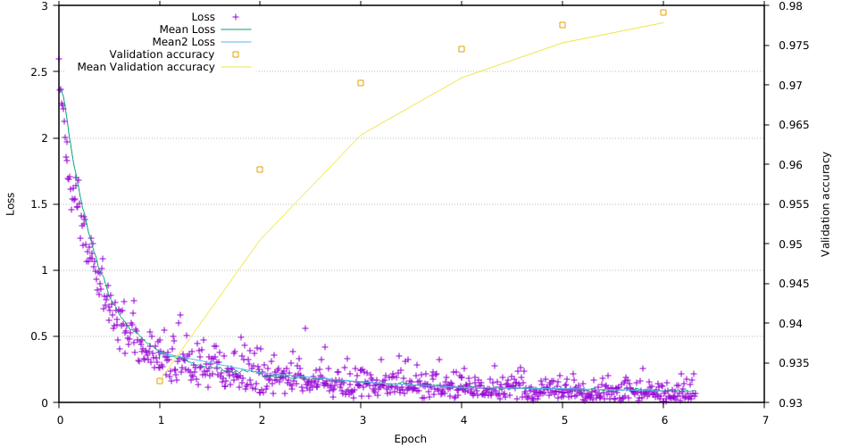

# Training with MNIST handwritten digits
## Requirements
Check the [main page](../../..) for build requirements.
## Build
After configuration of CMake, the mnist part can be built directly by:
```bash
make mnisttest
```
## Dataset
Use the [script download_mnist.py](../datasets/) to download the MNIST training data in HDF5 format.

## Training
From `Build` directory:
```bash
cpmnist/mnisttest ../datasets/mnist.h5
```
## Logging
For live logging of the training progress, use gnuplot:
```bash
gnuplot ../plots/liveplot.gnu
```

Note: Currently, this works only after 1. episode is complete.

## Output
```bash
$ cpmnist/mnisttest ../datasets/mnist.h5 
Reading: t_test t_train t_valid x_test x_train x_valid 
t_test (10000, 1)
t_train (50000, 1)
t_valid (10000, 1)
x_test (10000, 784)
x_train (50000, 784)
x_valid (10000, 784)
Compile-time options: FLOAT AVX FMA 
Eigen is using:      1 threads.
CpuPool is using:    4 threads.
Cpu+GpuPool is using:    0 threads.
Checking multi-layer topology...
cv1: (1, 28, 28)[784] -> (48, 28, 28)[37632]
sb1: (48, 28, 28)[37632] -> (48, 28, 28)[37632]
rl1: (48, 28, 28)[37632] -> (48, 28, 28)[37632]
doc1: (48, 28, 28)[37632] -> (48, 28, 28)[37632]
cv2: (48, 28, 28)[37632] -> (48, 28, 28)[37632]
rl2: (48, 28, 28)[37632] -> (48, 28, 28)[37632]
cv3: (48, 28, 28)[37632] -> (64, 14, 14)[12544]
sb2: (64, 14, 14)[12544] -> (64, 14, 14)[12544]
rl3: (64, 14, 14)[12544] -> (64, 14, 14)[12544]
doc2: (64, 14, 14)[12544] -> (64, 14, 14)[12544]
cv4: (64, 14, 14)[12544] -> (64, 14, 14)[12544]
rl4: (64, 14, 14)[12544] -> (64, 14, 14)[12544]
cv5: (64, 14, 14)[12544] -> (128, 7, 7)[6272]
sb3: (128, 7, 7)[6272] -> (128, 7, 7)[6272]
rl5: (128, 7, 7)[6272] -> (128, 7, 7)[6272]
doc3: (128, 7, 7)[6272] -> (128, 7, 7)[6272]
cv6: (128, 7, 7)[6272] -> (128, 7, 7)[6272]
rl6: (128, 7, 7)[6272] -> (128, 7, 7)[6272]
af1: (128, 7, 7)[6272] -> (1024)[1024]
bn1: (1024)[1024] -> (1024)[1024]
rla1: (1024)[1024] -> (1024)[1024]
do1: (1024)[1024] -> (1024)[1024]
af2: (1024)[1024] -> (512)[512]
bn2: (512)[512] -> (512)[512]
rla2: (512)[512] -> (512)[512]
do2: (512)[512] -> (512)[512]
af3: (512)[512] -> (10)[10]
sm1: (10)[10] -> (1)[1]
Topology-check for MultiLayer: ok.

Training net: data-size: 50000, chunks: 1000, batch_size: 50, threads: 4 (bz*ch): 50000
Ep: 1, Time: 405s, (65s test) loss:0.1842 err(val):0.0330 acc(val):0.9670
Ep: 2, Time: 406s, (66s test) loss:0.1084 err(val):0.0230 acc(val):0.9770
Ep: 3, Time: 433s, (70s test) loss:0.0689 err(val):0.0176 acc(val):0.9824
Ep: 4, Time: 421s, (73s test) loss:0.0704 err(val):0.0161 acc(val):0.9839
Ep: 5, Time: 416s, (69s test) loss:0.0525 err(val):0.0150 acc(val):0.9850
Ep: 6, Time: 442s, (86s test) loss:0.0483 err(val):0.0143 acc(val):0.9857
Ep: 7, Time: 475s, (82s test) loss:0.0529 err(val):0.0123 acc(val):0.9877
Ep: 8, Time: 471s, (83s test) loss:0.0418 err(val):0.0130 acc(val):0.9870
Ep: 9, Time: 436s, (66s test) loss:0.0331 err(val):0.0126 acc(val):0.9874
Ep: 10, Time: 411s, (72s test) loss:0.0455 err(val):0.0113 acc(val):0.9887
Ep: 11, Time: 468s, (81s test) loss:0.0278 err(val):0.0118 acc(val):0.9882
Ep: 12, Time: 428s, (73s test) loss:0.0390 err(val):0.0118 acc(val):0.9882
Ep: 13, Time: 437s, (82s test) loss:0.0297 err(val):0.0109 acc(val):0.9891
Ep: 14, Time: 416s, (73s test) loss:0.0270 err(val):0.0108 acc(val):0.9892
Ep: 15, Time: 415s, (70s test) loss:0.0253 err(val):0.0115 acc(val):0.9885
Ep: 16, Time: 405s, (66s test) loss:0.0312 err(val):0.0095 acc(val):0.9905
Ep: 17, Time: 404s, (66s test) loss:0.0252 err(val):0.0107 acc(val):0.9893
Ep: 18, Time: 404s, (67s test) loss:0.0196 err(val):0.0097 acc(val):0.9903
Ep: 19, Time: 436s, (76s test) loss:0.0286 err(val):0.0098 acc(val):0.9902
Ep: 20, Time: 427s, (71s test) loss:0.0198 err(val):0.0095 acc(val):0.9905
Ep: 21, Time: 414s, (70s test) loss:0.0247 err(val):0.0094 acc(val):0.9906
Ep: 22, Time: 411s, (71s test) loss:0.0218 err(val):0.0101 acc(val):0.9899
Ep: 23, Time: 410s, (67s test) loss:0.0201 err(val):0.0092 acc(val):0.9908
Ep: 24, Time: 419s, (78s test) loss:0.0192 err(val):0.0095 acc(val):0.9905
Ep: 25, Time: 426s, (81s test) loss:0.0249 err(val):0.0097 acc(val):0.9903
Ep: 26, Time: 412s, (71s test) loss:0.0137 err(val):0.0092 acc(val):0.9908
Ep: 27, Time: 410s, (70s test) loss:0.0165 err(val):0.0092 acc(val):0.9908
Ep: 28, Time: 407s, (65s test) loss:0.0192 err(val):0.0087 acc(val):0.9913
Ep: 29, Time: 398s, (63s test) loss:0.0221 err(val):0.0095 acc(val):0.9905
Ep: 30, Time: 399s, (64s test) loss:0.0241 err(val):0.0095 acc(val):0.9905
Ep: 31, Time: 399s, (65s test) loss:0.0175 err(val):0.0090 acc(val):0.9910
Ep: 32, Time: 399s, (64s test) loss:0.0145 err(val):0.0087 acc(val):0.9913
Ep: 33, Time: 399s, (64s test) loss:0.0113 err(val):0.0089 acc(val):0.9911
Ep: 34, Time: 399s, (64s test) loss:0.0157 err(val):0.0088 acc(val):0.9912
Ep: 35, Time: 399s, (64s test) loss:0.0150 err(val):0.0085 acc(val):0.9915
Ep: 36, Time: 409s, (71s test) loss:0.0181 err(val):0.0086 acc(val):0.9914
Ep: 37, Time: 426s, (72s test) loss:0.0203 err(val):0.0092 acc(val):0.9908
Ep: 38, Time: 435s, (87s test) loss:0.0154 err(val):0.0087 acc(val):0.9913
Ep: 39, Time: 423s, (71s test) loss:0.0139 err(val):0.0091 acc(val):0.9909
Ep: 40, Time: 412s, (70s test) loss:0.0116 err(val):0.0094 acc(val):0.9906
Final results on MNIST after 40.0000 epochs:
      Train-error: 0.0011 train-acc: 0.9989
 Validation-error: 0.0094   val-acc: 0.9906
       Test-error: 0.0100  test-acc: 0.9900
```
