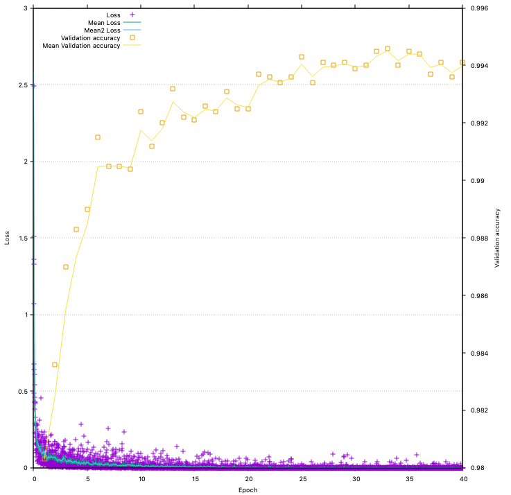

# Training with MNIST handwritten digits
## Requirements
Check the [main page](../../..) for build requirements.
## Build
After configuration of CMake, the mnist part can be built directly by:
```bash
make mnisttest
```
## Dataset
Use the [script download_mnist.py](../datasets/) to download the MNIST training data in HDF5 format.

## Training
From `Build` directory:
```bash
cpmnist/mnisttest ../datasets/mnist.h5
```
## Logging
For live logging of the training progress, use gnuplot:
```bash
gnuplot ../plot/liveplot.gnu
```

Note: Currently, this works only after 1. episode is complete.

## Output
```bash
$ cpmnist/mnisttest ../datasets/mnist.h5 
 ./cpmnist/mnisttest ../datasets/mnist.h5
Reading: t_test t_train t_valid x_test x_train x_valid
t_test (10000, 1)
t_train (50000, 1)
t_valid (10000, 1)
x_test (10000, 784)
x_train (50000, 784)
x_valid (10000, 784)
Compile-time options: FLOAT
Eigen is using:      1 threads.
CpuPool is using:    8 threads.
Checking multi-layer topology...
cv1: (1, 28, 28)[784] -> (48, 28, 28)[37632]
sb1: (48, 28, 28)[37632] -> (48, 28, 28)[37632]
rl1: (48, 28, 28)[37632] -> (48, 28, 28)[37632]
doc1: (48, 28, 28)[37632] -> (48, 28, 28)[37632]
cv2: (48, 28, 28)[37632] -> (48, 28, 28)[37632]
rl2: (48, 28, 28)[37632] -> (48, 28, 28)[37632]
cv3: (48, 28, 28)[37632] -> (64, 14, 14)[12544]
sb2: (64, 14, 14)[12544] -> (64, 14, 14)[12544]
rl3: (64, 14, 14)[12544] -> (64, 14, 14)[12544]
doc2: (64, 14, 14)[12544] -> (64, 14, 14)[12544]
cv4: (64, 14, 14)[12544] -> (64, 14, 14)[12544]
rl4: (64, 14, 14)[12544] -> (64, 14, 14)[12544]
cv5: (64, 14, 14)[12544] -> (128, 7, 7)[6272]
sb3: (128, 7, 7)[6272] -> (128, 7, 7)[6272]
rl5: (128, 7, 7)[6272] -> (128, 7, 7)[6272]
doc3: (128, 7, 7)[6272] -> (128, 7, 7)[6272]
cv6: (128, 7, 7)[6272] -> (128, 7, 7)[6272]
rl6: (128, 7, 7)[6272] -> (128, 7, 7)[6272]
af1: (128, 7, 7)[6272] -> (1024)[1024]
bn1: (1024)[1024] -> (1024)[1024]
rla1: (1024)[1024] -> (1024)[1024]
do1: (1024)[1024] -> (1024)[1024]
af2: (1024)[1024] -> (512)[512]
bn2: (512)[512] -> (512)[512]
rla2: (512)[512] -> (512)[512]
do2: (512)[512] -> (512)[512]
af3: (512)[512] -> (10)[10]
sm1: (10)[10] -> (1)[1]
Topology-check for MultiLayer: ok.

Training net: data-size: 50000, chunks: 1000, batch_size: 50, threads: 8 (bz*ch): 50000
Ep: 1, Time: 164s, (20s test) loss:0.1820 err(val):0.0333 acc(val):0.9667
Ep: 2, Time: 160s, (20s test) loss:0.1068 err(val):0.0214 acc(val):0.9786
Ep: 3, Time: 163s, (20s test) loss:0.0694 err(val):0.0183 acc(val):0.9817
Ep: 4, Time: 162s, (20s test) loss:0.0636 err(val):0.0157 acc(val):0.9843
Ep: 5, Time: 165s, (21s test) loss:0.0476 err(val):0.0136 acc(val):0.9864
Ep: 6, Time: 423s, (20s test) loss:0.0399 err(val):0.0126 acc(val):0.9874053
Ep: 7, Time: 164s, (20s test) loss:0.0422 err(val):0.0118 acc(val):0.9882
Ep: 8, Time: 163s, (20s test) loss:0.0318 err(val):0.0122 acc(val):0.9878
Ep: 9, Time: 271s, (19s test) loss:0.0294 err(val):0.0109 acc(val):0.9891
Ep: 10, Time: 340s, (20s test) loss:0.0263 err(val):0.0104 acc(val):0.9896
Ep: 11, Time: 168s, (20s test) loss:0.0241 err(val):0.0110 acc(val):0.9890
Ep: 12, Time: 161s, (20s test) loss:0.0228 err(val):0.0105 acc(val):0.9895
Ep: 13, Time: 161s, (20s test) loss:0.0231 err(val):0.0094 acc(val):0.9906
Ep: 14, Time: 166s, (20s test) loss:0.0200 err(val):0.0094 acc(val):0.9906
Ep: 15, Time: 167s, (22s test) loss:0.0166 err(val):0.0102 acc(val):0.9898
Ep: 16, Time: 276s, (130s test) loss:0.0186 err(val):0.0095 acc(val):0.9905
Ep: 17, Time: 498s, (99s test) loss:0.0122 err(val):0.0098 acc(val):0.9902
Ep: 18, Time: 1098s, (20s test) loss:0.0143 err(val):0.0100 acc(val):0.9900
Ep: 19, Time: 163s, (20s test) loss:0.0129 err(val):0.0090 acc(val):0.9910
Ep: 20, Time: 162s, (20s test) loss:0.0159 err(val):0.0096 acc(val):0.9904
Ep: 21, Time: 164s, (20s test) loss:0.0136 err(val):0.0093 acc(val):0.9907
Ep: 22, Time: 164s, (20s test) loss:0.0113 err(val):0.0083 acc(val):0.9917
Ep: 23, Time: 161s, (20s test) loss:0.0105 err(val):0.0090 acc(val):0.9910
Ep: 24, Time: 162s, (20s test) loss:0.0091 err(val):0.0088 acc(val):0.9912
Ep: 25, Time: 1158s, (21s test) loss:0.0109 err(val):0.0088 acc(val):0.9912
Ep: 26, Time: 165s, (21s test) loss:0.0082 err(val):0.0088 acc(val):0.9912
Ep: 27, Time: 166s, (22s test) loss:0.0091 err(val):0.0082 acc(val):0.9918
Ep: 28, Time: 191s, (23s test) loss:0.0080 err(val):0.0094 acc(val):0.9906
Ep: 29, Time: 197s, (22s test) loss:0.0103 err(val):0.0083 acc(val):0.9917
Ep: 30, Time: 198s, (23s test) loss:0.0105 err(val):0.0078 acc(val):0.9922
Ep: 31, Time: 206s, (23s test) loss:0.0075 err(val):0.0083 acc(val):0.9917
Ep: 32, Time: 202s, (22s test) loss:0.0080 err(val):0.0071 acc(val):0.9929
Ep: 33, Time: 965s, (21s test) loss:0.0068 err(val):0.0081 acc(val):0.99193
Ep: 34, Time: 161s, (20s test) loss:0.0047 err(val):0.0081 acc(val):0.9919
Ep: 35, Time: 164s, (20s test) loss:0.0040 err(val):0.0078 acc(val):0.9922
Ep: 36, Time: 163s, (20s test) loss:0.0069 err(val):0.0092 acc(val):0.9908
Ep: 37, Time: 162s, (20s test) loss:0.0079 err(val):0.0090 acc(val):0.9910
Ep: 38, Time: 1114s, (949s test) loss:0.0068 err(val):0.0087 acc(val):0.9913
Ep: 39, Time: 166s, (20s test) loss:0.0052 err(val):0.0084 acc(val):0.9916
Ep: 40, Time: 164s, (20s test) loss:0.0043 err(val):0.0104 acc(val):0.9896
Final results on MNIST after 40.0000 epochs:
      Train-error: 0.0007 train-acc: 0.9993
 Validation-error: 0.0104   val-acc: 0.9896
       Test-error: 0.0088  test-acc: 0.9912```
